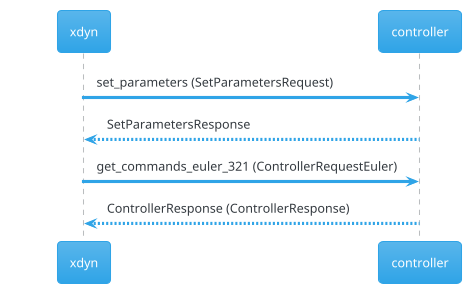
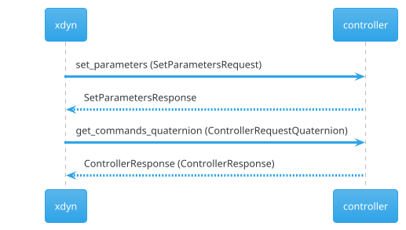

% Remote models in xdyn
% Charles-Edouard CADY
% July 13, 2021

# Pre-requisite: gRPC

## What is gRPC?

- Remote Procedure Call (RPC) allows calling functions from a
  different address space (or computer) as if they were local,
  without coding the details of the remote interaction
- gRPC is a RPC framework developped by Google & based on protocol buffers.
- It has pluggable support for load balancing, tracing, health checking and
  authentication.
- As it uses Protocol Buffers, it has a schema and encoders/decoders are
  generated for a variety of languages (Java, C++, Python...)

## Why are we using gRPC?

Using gRPC allows us to __extend xdyn in our language of choice__:

- We don't have to code everything in C++ anymore
- Some models can be kept private and still be used with xdyn
- We might want to run a given model in a very specific setting
  (hardware, software) for performance reasons
- gRPC supports all major platforms
- Using authentication, we can share models
- The gRPC interface forces us to specify the interface in a non-ambiguous way,
  which facilitates communication.


## How is gRPC used in xdyn?

gRPC is used to call remote models from xdyn:

- Force models
- Wave models
- Controllers

# Pre-requisite: `docker-compose`

## What is `docker-compose`?

> _"Compose is a tool for defining and running multi-container Docker
> applications. With Compose, you use a YAML file to configure your
> application’s services. Then, with a single command, you create and start all
> the services from your configuration."_ (Docker Compose documentation)


## Why are we using `docker-compose`

Although we could run each service "by hand", using `docker-compose` makes it
much easier: once our simulation is described it can be launched in a single
command and `docker-compose` provides facilities for logs, volumes, etc.

## How is `docker-compose` used in xdyn?

Any time we use remote models in xdyn we can use `docker-compose`.

`docker-compose` apps are described using a YAML file:

```yaml
version: '3'
services:
  force-model:
    image: sirehna/xdyn-force-grpc:python3
    command: harmonic_oscillator.py
    working_dir: /work
    volumes:
    - .:/work
  xdyn:
    image: sirehna/xdyn
    working_dir: /data
    entrypoint: xdyn model.yml --dt 0.1 --tend 0.2 -o out.csv
    volumes:
    - .:/data
    depends_on:
    - force-model
```

Launching the app is done with:

```
docker-compose up
```

# Remote force models

## Force interface

Three methods must be implemented for xdyn to be able to use a gRPC service:

```protobuf
service Force
{
    rpc set_parameters(SetForceParameterRequest)                  returns (SetForceParameterResponse);
    rpc force(ForceRequest)                                       returns (ForceResponse);
    rpc required_wave_information(RequiredWaveInformationRequest) returns (RequiredWaveInformationResponse);
}
```

Implementing the gRPC interface directly can be a hassle, which is why we
created the "interfaces" module
(https://gitlab.com/sirehna_naval_group/sirehna/interfaces). in this module,
there is a helper `force.py` module in Python: you just need to derive from the
`force.Model` class.


## Force interface - `set_parameters`

This method is called using the force model's intialization (before the first
time step). It is used to supply information both to xdyn and to the force model.

- Information given from xdyn to the force model:
  - Remote model's YAML inputs read from xdyn's input file
  - Name of the "body" frame
  - Instance name (if the same model is used everal times but with different parameters)
- Information given from the force model to xdyn:
  - Reference frame in which the forces and torques are expressed
  - Whether or not the force model needs to be supplied with wave data
  - If the model needs the state history, how far back should it go?
  - The commands needed by this model, so xdyn can check they are supplied

```python
def __init__(self, parameters, body_name):
    param = yaml.safe_load(parameters)
    self.c = param['c']
    self.body_name = body_name
```

## Force interface - `force`

- This method is where the actual force and torques are calculated.
- The force model can output extra observations (which can then be outputted
  by xdyn).

```python
def force(self, states, commands, __):
    k = commands['k']
    return {'Fx': -k*states.x[0] - self.c*states.u[0],
            'Fy': 0,
            'Fz': 0,
            'Mx': 0,
            'My': 0,
            'Mz': 0,
            'extra_observations': {'k': k, 'harmonic_oscillator_time': states.t[0]}}
```

## Example

```bash
git clone git@gitlab.com:CharlesEdouardCady_SIREHNA/xdyn-remote-models-examples.git
```

# Remote wave models

## Interface

```protobuf
service Waves
{
    rpc set_parameters(SetParameterRequest)                    returns (SetParameterResponse);
    rpc elevations(XYTGrid)                                    returns (XYZTGrid);
    rpc dynamic_pressures(XYZTGrid)                            returns (DynamicPressuresResponse);
    rpc orbital_velocities(XYZTGrid)                           returns (OrbitalVelocitiesResponse);
    rpc spectrum(SpectrumRequest)                              returns (SpectrumResponse);
    rpc angular_frequencies_for_rao(AngularFrequenciesRequest) returns (AngularFrequenciesResponse);
    rpc directions_for_rao(DirectionsRequest)                  returns (DirectionsResponse);
}
```

## Example

```bash
git clone git@gitlab.com:CharlesEdouardCady_SIREHNA/xdyn-remote-models-examples.git
```

## Other wave models

Depending on what a given wave model implements, some force models may not be available.

| Computed quantity  |  Force model using it   |
|--------------------|-------------------------|
| Wave elevations    | Non-linear hydrostatics |
| Dynamic pressure   | Froude-Krylov           |
| Orbital velocities | Rudder                  |
| Linear spectrum    | Diffraction             |

For example, for non-linear wave models (e.g. Choppy, HOS...) the wave model
needs to be linearized to retrieve a linear spectrum. Other approaches might
be possible (uncharted territory!)

# Remote controllers

## Interface (`set_parameters`)

```protobuf
service Controller
{
    // Initialize the controller with YAML parameters
    rpc set_parameters(SetParametersRequest)                 returns (SetParametersResponse);
}

message SetParametersRequest
{
    string parameters = 1; // YAML string containing the parameters to set for this particular model. Extracted verbatim from xdyn's YAML file
    double t0         = 2; // Date of the beginning of the simulation (first timestep) in seconds
}

message SetParametersResponse
{
    enum AngleRepresentation {
        QUATERNION = 0;
        EULER_321 = 1;
    }
    double              date_of_first_callback = 1; // Date at which the controller should be called for the first time. Will often be equal to just t0.
    repeated string     setpoint_names         = 2; // Name of the controller inputs (setpoints) which xdyn must supply.
    AngleRepresentation angle_representation   = 3; // Does the controller need to be called with get_commands_quaternion or with get_commands_euler_321?
    double              dt                     = 4; // Constant step of the controller. Only taken into account if dt>0: if dt==0, the controller is assumed to be a variable step controller and has to give the date at which the solver should call it again in ControllerResponse (next_call >= 0).
    repeated string     command_names          = 5; // Name of the outputs (commands) computed by the controller (matches the keys in ControllerResponse::commands)
}
```

## Interface (`get_commands_quaternion`)

```protobuf
service Controller
{
    // Calculate the commands using quaternions instead of angles
    rpc get_commands_quaternion(ControllerRequestQuaternion) returns (ControllerResponse);
}
```

```protobuf
message ControllerRequestQuaternion
{
    ControllerStatesQuaternion states     = 1; // Ship states
    ControllerStatesQuaternion dstates_dt = 2; // Ship state derivatives (at the previous time step)
    repeated double            setpoints  = 3; // Controller inputs (setpoints). Must have the same size as setpoint_names in SetParametersResponse.
}
```

```protobuf
message ControllerResponse
{
    map<string,double> commands = 1; // Commands computed by the controller
    double next_call           = 2; // Date at which the solver should call the controller again
}
```


```protobuf
message ControllerStatesQuaternion
{
    double t  = 1;  // Simulation time (in seconds).
    double x  = 2;  // Projection on axis X of the NED frame of the vector between the origin of the NED frame and the origin of the BODY frame
    double y  = 3;  // Projection on axis Y of the NED frame of the vector between the origin of the NED frame and the origin of the BODY frame
    double z  = 4;  // Projection on axis Z of the NED frame of the vector between the origin of the NED frame and the origin of the BODY frame
    double u  = 5;  // Projection on axis X of the BODY frame of the vector of the ship's speed relative to the ground (BODY/NED)
    double v  = 6;  // Projection on axis Y of the BODY frame of the vector of the ship's speed relative to the ground (BODY/NED)
    double w  = 7;  // Projection on axis Z of the BODY frame of the vector of the ship's speed relative to the ground (BODY/NED)
    double p  = 8;  // Projection on axis X of the BODY frame of the vector of the ship's rotation speed relative to the ground (BODY/NED)
    double q  = 9;  // Projection on axis Y of the BODY frame of the vector of the ship's rotation speed relative to the ground (BODY/NED)
    double r  = 10; // Projection on axis Z of the BODY frame of the vector of the ship's rotation speed relative to the ground (BODY/NED)
    double qr = 11; // Real part of the quaternion defining the rotation from the NED frame to the ship's BODY frame
    double qi = 12; // First imaginary part of the quaternion defining the rotation from the NED frame to the ship's BODY frame
    double qj = 13; // Second imaginary part of the quaternion defining the rotation from the NED frame to the ship's BODY frame
    double qk = 14; // Third imaginary part of the quaternion defining the rotation from the NED frame to the ship's BODY frame
}
```

## Interface (`get_commands_euler_321`)

```protobuf
service Controller
{
    // Calculate the commands using angles in Rned2body = Rz(ψ).Ry(θ).Rx(ϕ) rotation convention
    rpc get_commands_euler_321(ControllerRequestEuler)       returns (ControllerResponse);
}
```

```protobuf
message ControllerRequestEuler
{
    ControllerStatesEuler states     = 1; // Ship states history
    ControllerStatesEuler dstates_dt = 2; // Ship state derivatives history
    repeated double       setpoints  = 3; // Controller inputs (setpoints). Must have the same size as setpoint_names in SetParametersResponse.
}
```

```protobuf
message ControllerResponse
{
    map<string,double> commands = 1; // Commands computed by the controller
    double next_call            = 2; // Date at which the solver should call the controller again
}
```

## Sequence diagram





## Example

```bash
git clone git@gitlab.com:CharlesEdouardCady_SIREHNA/xdyn-remote-models-examples.git
```
